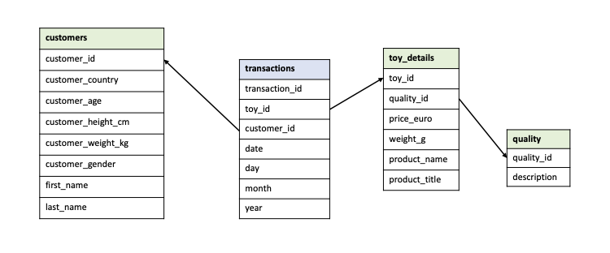

# Homework week 9 - PDA data transformation task

## PDA outcomes covered

* 1.8 Data management including security
* 3.1 Tools for data transformation including tools for automating data transformation
* 3.2 Types of data transformation
* 3.3 Transformations including joins
* 3.4 String manipulation including extracting a substring, replacing part of a string, joining strings and splitting strings
* 3.5 Data cleaning
* 3.6 Data modelling including star schema
* 3.7 Data loading
* 3.8 Legal and ethical considerations for data storage

### Question 1

```{r}
# Q1 - Load in the transaction data and create a column date from the day, month and year columns.

# first load libraries
library(tidyverse)

# load in dataset
toy_transactions <- read_csv("raw_data/toy_transactions.csv")

# do some data exploration
head(toy_transactions)
#glimpse(toy_transactions)

# create the column date from day, month, year
transactions <- toy_transactions %>% 
  mutate(date = make_datetime(year, month, day), .before = day)

transactions
```

### Question 2

```{r}
# Q2 - Load in the toys data and:
# 1. Convert the weight column to numeric.

toys <- read_csv("raw_data/toys.csv")

toys_weight <- toys %>% 
  mutate(weight = str_replace(weight, "[g]", replacement = "")) %>% 
  mutate(weight = as.numeric(weight)) %>% 
  rename(weight_g = weight)

toys_weight

# 2. Split the extra information from the product into a new column, so you have 
# two columns: product_name and product_title. Make sure you don’t have any extra 
# whitespace in either column.

# old method ( please skip!)
# toy_details <- toys_weight %>% 
#  mutate(product_name = str_extract(product, "- [:alpha:]+ ?[:alpha:]*")) %>% 
#  mutate(product_title = str_extract(product, "^[:alpha:]*.?[:alpha:]*.?[:alpha:]*")) %>% 
#  mutate(product_name = str_replace(product_name, "^- ", replacement = "")) %>% 
#  mutate(product_title = str_replace(product_title, " -$", replacement = "")) %>% 
#  select(!product) %>% 
#  rename(toy_id = id, quality_id = quality)

# Or alternatively (safer and much easier!):

toy_details <- toys_weight %>% 
  separate(col = "product", sep = " - ", into = c("product_name", "product_title")) %>% 
  rename(toy_id = id, quality_id = quality)

toy_details

```

### Question 3

```{r}
# Q3 - Load in the dataset on quality labels and:
# 1. Remove the unnecessary information for each descriptor

quality_raw <- read_csv("raw_data/quality.csv")

quality <- quality_raw %>% 
  mutate(description = str_replace(description, "^Quality: ", replacement = "")) %>% 
# 2. Replace the categories so ‘Awesome’ and ‘Very Awesome’ become ‘Good’ and 
# ‘Very Good’. Do the same thing for ‘Awful’ replacing it with ‘Bad’.
  mutate(description = recode(description,
                              "Very Awesome" = "Very Good",
                              "Awesome" = "Good",
                              "Awful" = "Bad",
                              "Very Awful" = "Very Bad")) %>% 
  rename(quality_id = id)

quality
```

### Question 4

```{r}
# Q4 - create a dataframe called customers which contains data on customers from 
# all countries by reading in and binding all customer datasets in one pipeline

library(fs)

# create the dataframe combining all customer csv's
customers_all <- dir_ls("raw_data/", regexp = "customers.csv$") %>% 
  map_dfr(read_csv) %>% 
  rename(customer_id = id)

customers_all
```

### Question 5

```{r}
# Q5 - Impute missing values in numeric columns with the median value of customers 
# with the same gender and country. 

customers <- customers_all %>% 
  group_by(customer_gender, customer_country) %>% 
  mutate(across(where(is.numeric), ~ coalesce(., median(., na.rm = TRUE))))

customers
```

### Question 6

star-schema
{width=100%}

### Question 7

```{r}
# Q7 - Join your four cleaned datasets together and call the joined dataset toys_joined. 
# This join should keep all observations from all tables.

toys_joined <- transactions %>% 
full_join(customers, by = "customer_id") %>% 
  full_join(toy_details, by = "toy_id") %>% 
  left_join(quality, by = "quality_id")

toys_joined
```

### Question 8

Are there any ethical and legal considerations with storing this data in its current state?

Answer: <br>
We want to follow ethical considerations and privacy regulations. We therefor 
want to anonymise this dataset in order to make sure that this data cannot be
traced back to a single identifiable person.

### Question 9

```{r}
# Q9 - Remove any personally identifiable or sensitive information on customers

# Let's remove columns that hold sensitive information:

toys_joined_anonymous <- toys_joined %>% 
  select(-first_name, -last_name, -customer_age, -customer_gender, -customer_height_cm,
         -customer_weight_kg)

toys_joined_anonymous
```

### Question 10

```{r}
# Q10 - Write your new joined dataset (which does not contain personal/sensitive information) to a csv file

toys_joined_anonymous %>% 
write_csv("toy_purchases_anonymous.csv")
```

### Question 11

Use a .gitignore file to make sure the raw data on customers which still 
contains personal/sensitive information is not pushed up to your PDA GitHub.

```{r}
# add the following sensitive customer info files to gitignore:

files_to_ignore <- dir_ls("raw_data/", regexp = "customers.csv$") %>% 
  str_sub(start = 10) 
  
files_to_ignore

# write text file containing the names
writeLines(files_to_ignore, "ignore_files.txt")

# And add these files to the gitignore file (see screenshot provided as evidence!)
```


